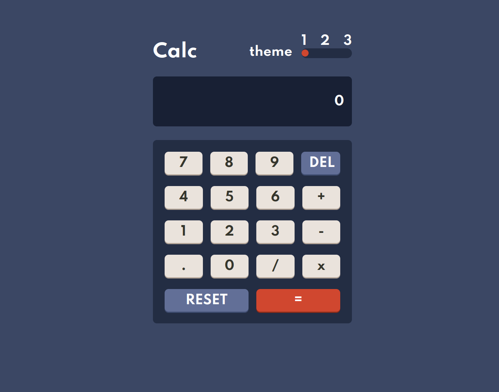
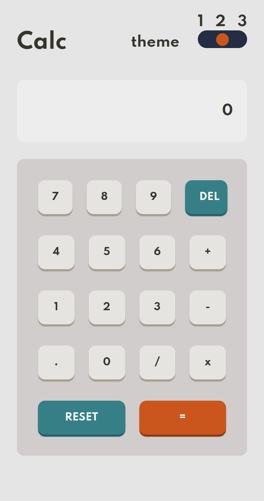
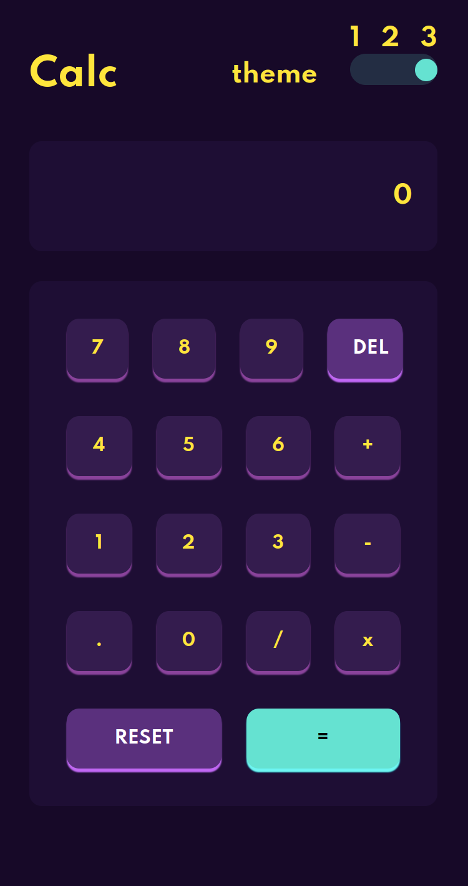

# Frontend Mentor - Calculator app solution

This is a solution to the [Calculator app challenge on Frontend Mentor](https://www.frontendmentor.io/challenges/calculator-app-9lteq5N29). Frontend Mentor challenges help you improve your coding skills by building realistic projects. 

## Table of contents

- [Overview](#overview)
  - [The challenge](#the-challenge)
  - [Screenshot](#screenshot)
  - [Links](#links)
- [My process](#my-process)
  - [Built with](#built-with)
  - [What I learned](#what-i-learned)
  - [Continued development](#continued-development)
- [Author](#luizamaro11)

## Overview

### The challenge

Users should be able to:

- View the optimal layout for the site depending on their device's screen size
- See hover states for all interactive elements on the page

### Screenshot

### Links

- Solution only on local machine

## My process

### Built with

- Semantic HTML5 markup
- CSS custom properties
- Flexbox
- CSS Grid
- Mobile workflow
- responsive CSS with media query
- javascript
- viteJs for build project
- npm

### What I learned

I used this challenge to further improve my skills as a front-end developer.

### Continued development

As a continuation of my studies, I intend to take challenges with css animations and their keyframes.

utility javascript modules and and advance more, more in javascript and also develop web pages using javascript for DOM manipulation and among other things.

## Author

- github - [@luizamaro11](https://github.com/luizamaro11)
- Frontend Mentor - [@luizamaro11](https://www.frontendmentor.io/profile/luizamaro11)
