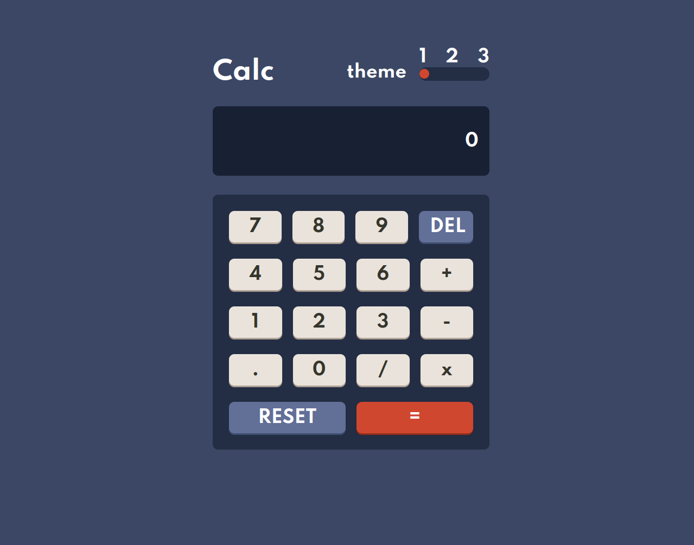
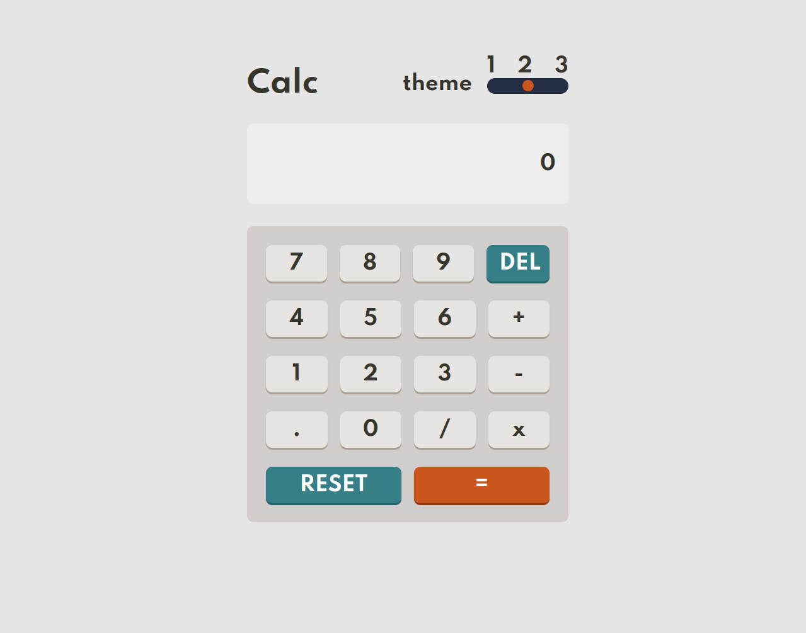
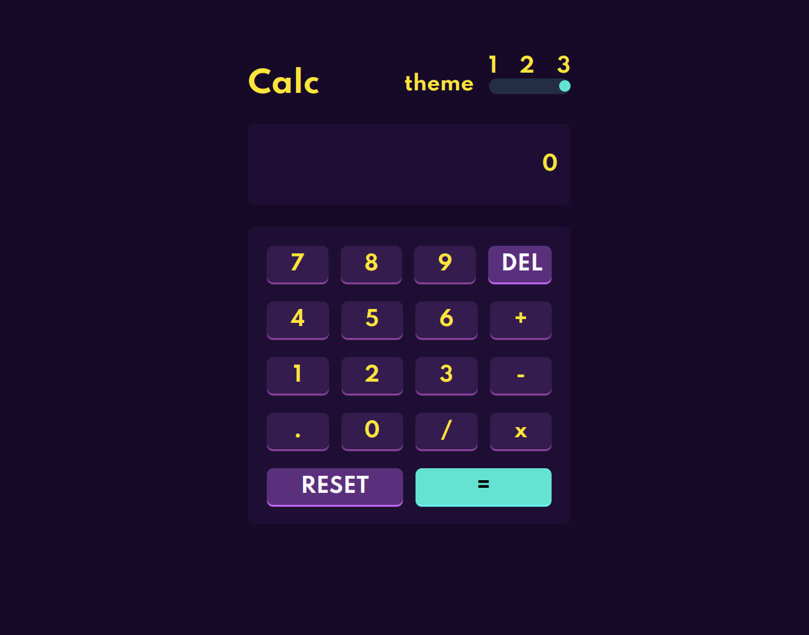
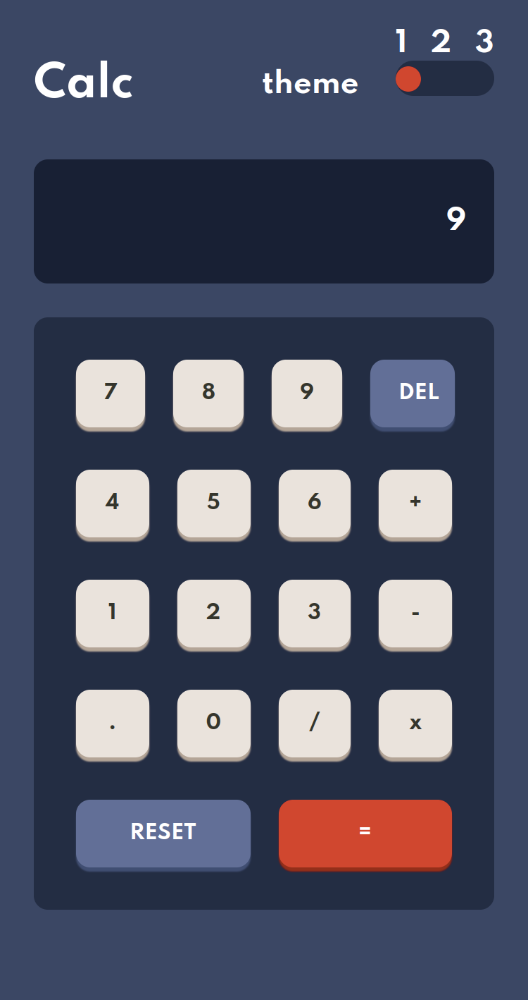
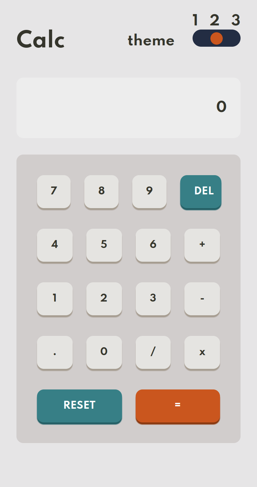
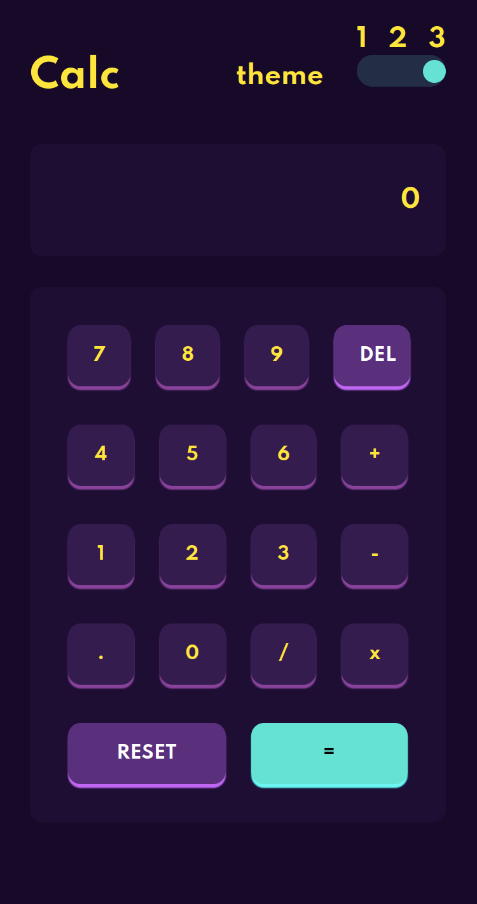

# Frontend Mentor - Solução de aplicativo de calculadora

Esta é uma solução para o [desafio do aplicativo Calculadora no Frontend Mentor](https://www.frontendmentor.io/challenges/calculator-app-9lteq5N29). Os desafios do Frontend Mentor ajudam você a melhorar suas habilidades de codificação construindo projetos realistas. 

## Table of contents

- [Visao geral](#visao-geral)
  - [O desafio](#o-desafio)
  - [Captura de tela](#captura-de-tela)
  - [Links](#links)
- [Meu processo](#meu-processo)
  - [Construido com](#construido-com)
  - [O que eu aprendi](#o-que-eu-aprendi)
  - [Desenvolvimento continuo](#desenvolvimento-continuo)
- [Autor](#luizamaro11)

## Visao geral

### O desafio

Os usuários devem ser capazes de:

- Visualizar o layout ideal para o site dependendo do tamanho da tela do seu dispositivo
- Ver estados de foco para todos os elementos interativos na página

### Captura de tela

### Links

- Solução somente na máquina local

## Meu processo

### Construido com

- Marcação semântica HTML5
- Propriedades personalizadas CSS
- Flexbox
- CSS Grid
- Fluxo de trabalho móvel
- CSS responsivo com media query
- javascript
- viteJs para projeto de construção
- npm

### O que eu aprendi

Usei esse desafio para melhorar ainda mais minhas habilidades como desenvolvedor front-end.

### Desenvolvimento continuo

As a continuation of my studies, I intend to take challenges with css animations and their keyframes.

utility javascript modules and and advance more, more in javascript and also develop web pages using javascript for DOM manipulation and among other things.

Como continuação dos meus estudos, pretendo encarar desafios com animações css e seus keyframes.

E avançar mais em javascript como os módulos javascript e também desenvolver páginas web usando javascript para manipulação de DOM e entre outras coisas.

## Autor

- github - [@luizamaro11](https://github.com/luizamaro11)
- Frontend Mentor - [@luizamaro11](https://www.frontendmentor.io/profile/luizamaro11)
